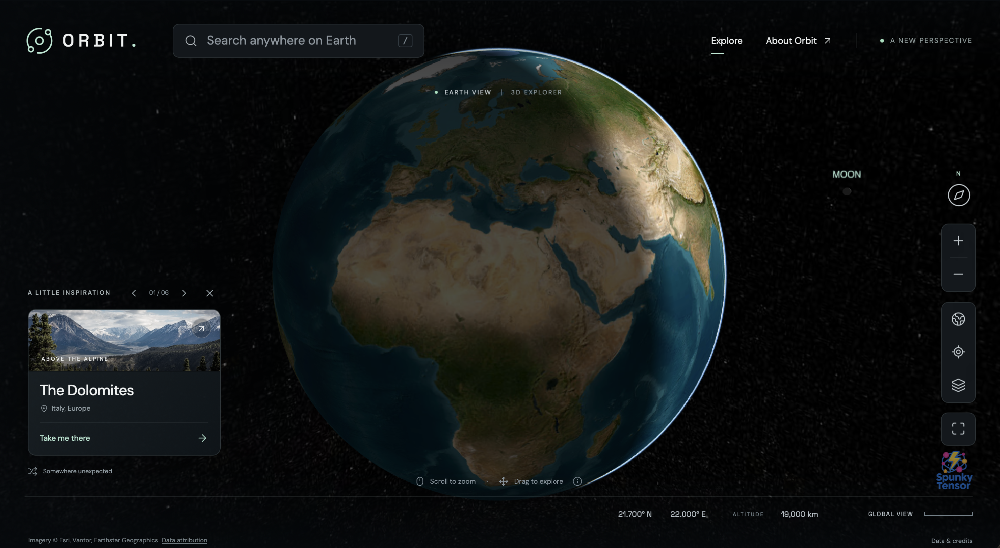

# Orbit — Earth Explorer

[](https://github.com/spunkytensor/orbit/actions/workflows/ci.yml)
[](https://github.com/spunkytensor/orbit/actions/workflows/security.yml)

A TypeScript / Vite / CesiumJS globe with WebGL rendering, streamed satellite imagery, a real astronomical star map, place search, and a minimal responsive interface. No API keys are required for the configured public endpoints.



## License and project policies

Original code and documentation are licensed under the [Apache License 2.0](LICENSE).
See [NOTICE](NOTICE) and [third-party attributions](THIRD_PARTY_NOTICES.md) for
separately licensed dependencies, photographs, fonts, and data. The code license
does not grant permission to use external services: the free Open-Meteo endpoint
is non-commercial, and Esri imagery has its own deployment terms.

- [Contributing and community expectations](CONTRIBUTING.md)
- [Security policy and vulnerability reporting](SECURITY.md)
- [Privacy and external requests](PRIVACY.md)
- [Maintainer public-release checklist](RELEASE_CHECKLIST.md)

The npm package stays `private: true` to prevent accidental registry publication;
this does not prevent publishing the source repository under Apache-2.0.

## Run

Use Node.js 22.12+ (tested with Node 26).

```sh
npm ci
npm run dev
npm test
npm run build
npm run preview
```

Deploy the generated `dist/` directory to a static web host at its root. The build copies Cesium workers, star maps, and the Natural Earth fallback into `dist/cesium/`; keep that directory with the app. No backend is required. External imagery and search need an Internet connection and a browser with WebGL enabled.

The build also preserves project and installed runtime dependency license notices
in `dist/licenses/`. Keep this directory with every deployed or redistributed
bundle and review `inventory.json` for packages lacking standalone license files.

## Explore

- Drag in any direction to pan; wheel or pinch to zoom. Pinch, wheel, and + / − share continuous damped motion in Cesium's frame cycle, including settling after gesture release. Repeated inputs change the target without resetting velocity; opposite inputs undo the queued scale change. Pinching uses the ratio of finger separations rather than fixed zoom steps. Slow frames advance by a bounded step instead of skipping the animation. Dragging or flying to a destination cancels zoom. Reduced motion shortens manual zoom rather than making it jump, and still disables destination-flight animation. Cesium handles pan inertia and tile refinement, retaining parent imagery until child tiles are ready.
- Use **+ / −**, **H** for the globe view, **/** for search, or focus the globe and use arrow keys.
- A small **MOON** label marks the Moon's current location when it is in view; the lunar body retains its real size and phase. Earth hides the label when it blocks the Moon.
- Zoom gestures on the canvas move the camera, not the page. Pinching over controls does not magnify the interface; panels still support vertical scrolling. Safari trackpad gestures and touchscreen pinches feed the same smooth scene zoom without applying duplicate events.
- The crosshair button fits an approximately **1 km-wide surface view** (not 1 km altitude). It derives camera height from horizontal field of view; the footer measures surface distance independently using ellipsoid ray intersections.
- Search cities worldwide, pick one of six destinations, or enter `latitude, longitude` in decimal degrees. Coordinates work without a geocoding service.
- Layers offers satellite or NASA imagery. The astronomical star field and current-time day/night lighting are always enabled; locations on Earth's night side appear dark.

## Imagery research and service terms

| Source | Use in Orbit | Coverage / limitations | Access and terms |
| --- | --- | --- | --- |
| [Esri World Imagery](https://www.arcgis.com/home/item.html?id=10df2279f9684e4a9f6a7f08febac2a9) | Default satellite/aerial tiles with metadata-based credits | World coverage, approximately 15 m at medium scales; meter/submeter imagery in many regions. Capture dates and detail vary. Mercator tiles stop near ±85.05° latitude. | The public `services.arcgisonline.com` MapServer accepts unauthenticated requests at implementation time. **Public access is not an unrestricted open-data license or a guaranteed free commercial entitlement.** Review Esri’s linked terms before public/commercial deployment. Keep attribution; do not bulk-download tiles for offline use. |
| [NASA GIBS](https://www.earthdata.nasa.gov/engage/open-data-services-software/earthdata-developer-portal/gibs-api) | Optional Blue Marble Shaded Relief / Bathymetry WMTS layer | 500 m/pixel global composite; unsuitable for street-level detail. Maximum tile level 8. | Free, open access, no key. Acknowledgment included. [API documentation](https://nasa-gibs.github.io/gibs-api-docs/access-basics/). |
| [Natural Earth II](https://www.naturalearthdata.com/about/terms-of-use/) | Bundled fallback beneath all streamed layers, including polar caps | Low-resolution world map; available when tile services fail. | Public domain. Packaged with Cesium. |
| [Open-Meteo / GeoNames](https://open-meteo.com/en/docs/geocoding-api) | Explicit-submit city search, no remote autocomplete | Place names, not street addresses | Free API is **non-commercial**, subject to [usage limits](https://open-meteo.com/en/terms). Commercial apps must replace or license this service. |

We acknowledge the use of imagery provided by services from NASA's Global Imagery Browse Services (GIBS), part of NASA's Earth Science Data and Information System (ESDIS).

### Stars and geometry

The globe uses the WGS84 ellipsoid. The sky uses Cesium’s bundled Tycho-2 cube map, oriented in True Equator Mean Equinox (TEME) axes and transformed at the current time. This is not a procedural/random star field. [Cesium SkyBox documentation](https://cesium.com/learn/cesiumjs/ref-doc/SkyBox.html).

Cesium’s astronomically positioned Sun and Moon appear when they are in the camera’s field of view and not occluded by Earth. Day/night surface shading is always enabled. The Moon retains Cesium’s analytical lunar ephemeris, physical radius, texture, and Sun-lit phase. A dim neutral fill reveals the otherwise black lunar disk near new moon; this is an identification aid, not a physical Earthshine simulation. The fill is strongest on the unlit side, fades to zero on directly sunlit surfaces, and does not enlarge the Moon or show through Earth.

The clock follows the current system time, including after tab suspension. Idle views redraw approximately once per minute for celestial motion; navigation and imagery updates redraw as needed. This is a geographic explorer, not a precision astronomical ephemeris tool. Terrain elevation, 3D buildings, live weather, and live satellite feeds are not included. Polar detail and ocean detail are limited by the available data. Imagery refines as network requests complete, not as a guaranteed frame-perfect crossfade. Real performance depends on GPU, network, viewport, and device memory; request-render mode, tile caching, parent retention, and capped rendering resolution reduce load.

### Destination photographs

Local destination thumbnails are downloaded from Unsplash, separate from the georeferenced map imagery. [Unsplash license](https://unsplash.com/license). Source image IDs: `photo-1464822759023-fed622ff2c3b`, `photo-1474044159687-1ee9f3a51722`, `photo-1546026423-cc4642628d2b`, `photo-1485871981521-5b1fd3805eee`, `photo-1490806843957-31f4c9a91c65`, `photo-1509316785289-025f5b846b35`.

## Validation

`npm test` checks coordinates and distance formatting, damped zoom and pinch ratios, compass orientation, lunar orbital distance and time progression, and lunar identification fill. `npm run build` runs strict TypeScript checking and produces a production bundle.

Browser smoke checks: full Earth with loaded tiles; New York at 1 km width; drag and keyboard panning at that scale; NASA imagery switching with persistent star field and day/night lighting; city/coordinate search; invalid input; discovery dialog; desktop and narrow layouts; sky double-taps, canvas pinches, UI pinches, and search focus without changing the document's scale or offset. Synthetic WebKit gesture events check the event-routing contract but do not replace real Safari device verification. Use a hardware-accelerated browser for performance assessment; the orb’s Chromium may use software WebGL.
